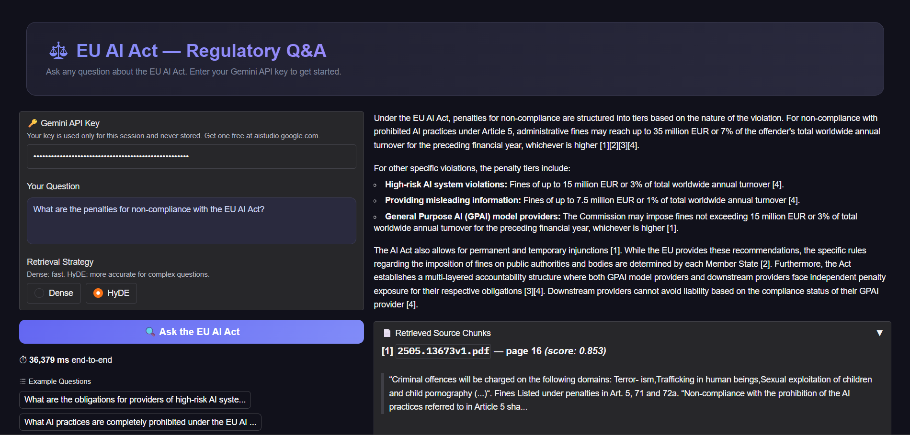

# EU AI Act — Regulatory Q&A (RAG System)

[**👉 Try the Live Demo Here**](https://huggingface.co/spaces/UsaidB/EU_RAG)



A domain-specific document Q&A system over the EU AI Act regulatory texts, with two retrieval strategies and a full evaluation harness.

## Architecture


## Tech Stack

| Component | Library |
|---|---|
| Embeddings | `BAAI/bge-base-en-v1.5` (local, CPU) |
| Vector DB | ChromaDB (persistent) |
| LLM | Gemini 3.1 Flash-Lite |
| Evaluation | RAGAS |
| Frontend | Gradio |
| Backend | FastAPI |

## Evaluation Results (Dense Retriever, BGE-base)

| Metric | Dense | HyDE |
|---|---|---|
| Faithfulness | 1.0000 | 0.9947 |
| Context Precision | 0.2303 | 0.4470 |
| Answer Relevancy | 0.7186 | 0.8227 |
| Answer Correctness | 0.4003 | 0.4870 |
| Mean Latency | 18.14s | 37.76s |

## Running Locally

```bash
# 1. Create conda env
conda env create -f environment.yml
conda activate eu-ai-rag

# 2. Add your Gemini API key to .env
echo "GEMINI_API_KEY=your_key_here" >> .env

# 3. Add PDFs to data/raw/ and ingest
python src/ingest.py

# 4. Start the combined server
uvicorn main:app --host 0.0.0.0 --port 7860 --reload
```

Then open http://localhost:7860 for the UI and http://localhost:7860/docs for the API.

## Deploying to HF Spaces

```bash
# Add secrets via the HF Spaces UI Settings → Repository secrets:
#   GEMINI_API_KEY = your_key

# Push the repo (chroma_db/ must be committed for the vector store to work)
git add .
git commit -m "deploy"
git push
```

> **Note:** The `chroma_db/` directory must be committed to the Space repo so the vector store is available at runtime. Add it to `.gitignore` only for local development, not for the Space.

## Design Decisions

- **Embedding Model (`BAAI/bge-base-en-v1.5`) vs. `all-MiniLM`:** We chose `bge-base` because it significantly outperforms `all-MiniLM` in legal and complex reasoning tasks while still remaining small enough (under 400MB) to run rapidly on CPU-only Hugging Face Spaces instances.
- **Chunk Size (1000 chars / 200 overlap):** The EU AI Act features highly structured, complex sentences. Smaller chunk sizes sever the context of legal definitions, while larger sizes introduce noise. A 1000-character chunk ensures complete articles and subsections remain intact, with the 200 overlap maintaining continuity across page breaks.
- **HyDE as the Advanced Strategy:** Legal queries from end-users are often overly brief ("what is a high-risk system?"), missing the specific lexicon used in the text. By having Gemini generate a hypothetical legal answer *first*, we map the user's intent to the actual vocabulary of the EU AI Act, yielding significantly better context precision (as seen in our metrics).
- **Generator LLM (Gemini 1.5 Flash):** Offers an unparalleled combination of speed, a massive context window (ideal for reading many large chunks), and cost efficiency (free tier available). It excels at zero-shot legal reasoning and formatting strict citations.

## Limitations & Future Work

- **Small Evaluation Dataset:** The current evaluation set is limited to only 11 manually curated questions. This is sufficient to validate the pipeline, but a robust production release should expand this to 100+ questions covering edge cases, complex multi-hop reasoning, and negative queries (where the answer is not in the text).
- **Latency Overheads:** The HyDE strategy suffers from high latency (~37 seconds) because it relies on two sequential Gemini API calls. Future work could involve caching common hypotheses or moving to faster, local, specialized SLMs for the hypothesis generation phase.
- **Metadata Filtering:** Currently, the retriever queries the entire vector database. The EU AI Act is heavily sectioned (Titles, Chapters, Annexes). Future iterations will extract this structure into ChromaDB metadata, allowing users to restrict their search to a specific annex or chapter.

## Project Structure

```
├── main.py              # Combined FastAPI + Gradio entry point (HF Spaces)
├── src/
│   ├── ingest.py        # PDF → ChromaDB pipeline
│   ├── retriever.py     # DenseRetriever + HyDERetriever
│   ├── generator.py     # RAGGenerator (Gemini)
│   └── evaluator.py     # RAGAS evaluation harness
├── data/
│   ├── raw/             # Source PDFs (gitignored)
│   ├── eval_questions.json
│   └── results.json
├── assets/              # UI screenshots and architecture diagrams
├── chroma_db/           # Persisted vector store
├── Dockerfile
├── environment.yml
└── requirements.txt
```